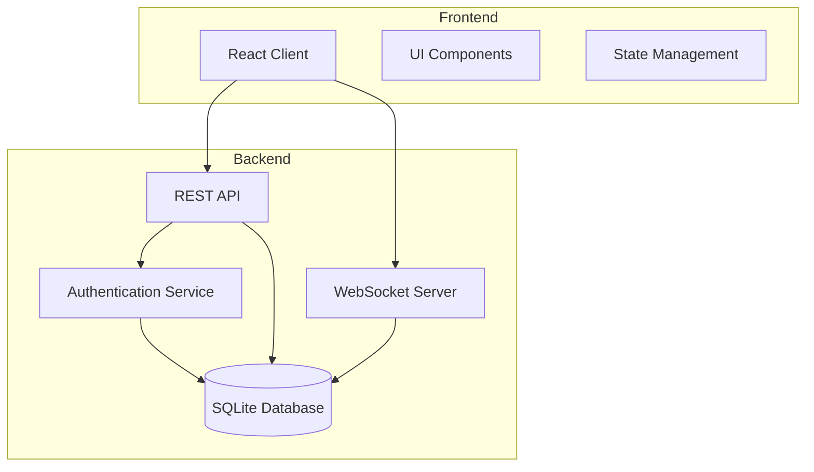

# Design Document: Telegram Clone

## Overview

The Telegram clone is a full-stack web application that provides real-time messaging capabilities. The system follows a client-server architecture with WebSocket connections for real-time communication, RESTful APIs for data operations, and a React-based frontend with a Node.js backend.

## Architecture



The system uses a layered architecture:
- **Presentation Layer**: React components with TypeScript
- **API Layer**: Express.js REST endpoints
- **Real-time Layer**: Socket.io WebSocket server
- **Data Layer**: SQLite database with proper schema design

## Components and Interfaces

### Frontend Components

#### Authentication Components
- **LoginForm**: Handles user login with username/password validation
- **RegisterForm**: Manages new user registration with input validation
- **AuthProvider**: Context provider for authentication state management

#### Chat Components
- **ChatList**: Displays list of user's chats with recent message previews
- **ChatWindow**: Main conversation interface showing messages and input
- **MessageItem**: Individual message component with sender info and timestamp
- **MessageInput**: Text input with send functionality and Enter key support

#### Layout Components
- **Sidebar**: Contains chat list and user profile information
- **MainArea**: Houses the active chat window
- **Header**: Shows current chat information and connection status

### Backend Services

#### Authentication Service
```typescript
interface AuthService {
  register(username: string, email: string, password: string): Promise<AuthResult>
  login(username: string, password: string): Promise<AuthResult>
  verifyToken(token: string): Promise<User>
}
```

#### Chat Service
```typescript
interface ChatService {
  getUserChats(userId: string): Promise<Chat[]>
  createChat(participants: string[]): Promise<Chat>
  getMessages(chatId: string): Promise<Message[]>
  sendMessage(chatId: string, userId: string, content: string): Promise<Message>
}
```

#### WebSocket Service
```typescript
interface SocketService {
  joinChat(socket: Socket, chatId: string): void
  broadcastMessage(chatId: string, message: Message): void
  handleDisconnection(socket: Socket): void
}
```

## Data Models

### User Model
```typescript
interface User {
  id: string          // UUID primary key
  username: string    // Unique username
  email: string       // Unique email address
  password: string    // Bcrypt hashed password
  avatar?: string     // Optional avatar URL
  created_at: Date    // Account creation timestamp
}
```

### Chat Model
```typescript
interface Chat {
  id: string          // UUID primary key
  name?: string       // Optional chat name (for groups)
  type: 'private'     // Chat type (private for now)
  created_at: Date    // Chat creation timestamp
  participants: User[] // Chat members
  lastMessage?: Message // Most recent message
}
```

### Message Model
```typescript
interface Message {
  id: string          // UUID primary key
  chat_id: string     // Foreign key to chat
  user_id: string     // Foreign key to user (sender)
  content: string     // Message text content
  created_at: Date    // Message timestamp
  username: string    // Sender username (for display)
}
```

### Database Schema
```sql
-- Users table
CREATE TABLE users (
  id TEXT PRIMARY KEY,
  username TEXT UNIQUE NOT NULL,
  email TEXT UNIQUE NOT NULL,
  password TEXT NOT NULL,
  avatar TEXT,
  created_at DATETIME DEFAULT CURRENT_TIMESTAMP
);

-- Chats table
CREATE TABLE chats (
  id TEXT PRIMARY KEY,
  name TEXT,
  type TEXT DEFAULT 'private',
  created_at DATETIME DEFAULT CURRENT_TIMESTAMP
);

-- Messages table
CREATE TABLE messages (
  id TEXT PRIMARY KEY,
  chat_id TEXT NOT NULL,
  user_id TEXT NOT NULL,
  content TEXT NOT NULL,
  created_at DATETIME DEFAULT CURRENT_TIMESTAMP,
  FOREIGN KEY (chat_id) REFERENCES chats (id),
  FOREIGN KEY (user_id) REFERENCES users (id)
);

-- Chat members junction table
CREATE TABLE chat_members (
  chat_id TEXT NOT NULL,
  user_id TEXT NOT NULL,
  joined_at DATETIME DEFAULT CURRENT_TIMESTAMP,
  PRIMARY KEY (chat_id, user_id),
  FOREIGN KEY (chat_id) REFERENCES chats (id),
  FOREIGN KEY (user_id) REFERENCES users (id)
);
```

## Correctness Properties

*A property is a characteristic or behavior that should hold true across all valid executions of a system-essentially, a formal statement about what the system should do. Properties serve as the bridge between human-readable specifications and machine-verifiable correctness guarantees.*

After analyzing the acceptance criteria, the following properties have been identified for property-based testing:

### Authentication Properties

**Property 1: Valid registration creates accounts**
*For any* valid user registration data (unique username, valid email, strong password), the system should successfully create a user account and return success
**Validates: Requirements 1.1**

**Property 2: Invalid registration returns errors**
*For any* invalid registration data (duplicate username, invalid email, weak password), the system should reject the registration and return descriptive error messages
**Validates: Requirements 1.2**

**Property 3: Valid login succeeds**
*For any* registered user with correct credentials, the login attempt should succeed and return a valid JWT token
**Validates: Requirements 1.3**

**Property 4: Invalid login fails**
*For any* incorrect login credentials (wrong password, non-existent user), the login attempt should be rejected
**Validates: Requirements 1.4**

**Property 5: Password hashing security**
*For any* user password, the stored password should be a bcrypt hash and never stored in plaintext
**Validates: Requirements 1.5**

**Property 6: JWT token generation**
*For any* successful authentication, the system should return a valid JWT token that can be verified
**Validates: Requirements 1.6**

### Messaging Properties

**Property 7: Message persistence**
*For any* message sent in a chat, the message should be immediately stored in the database with correct relationships
**Validates: Requirements 2.6**

**Property 8: Message history loading**
*For any* chat that a user joins, all existing messages in that chat should be loaded and displayed
**Validates: Requirements 2.4, 4.2**

**Property 9: Message display formatting**
*For any* displayed message, it should include the sender username and timestamp information
**Validates: Requirements 4.1**

**Property 10: Message chronological ordering**
*For any* set of messages in a chat, they should be displayed in chronological order by timestamp
**Validates: Requirements 4.3**

### Chat Management Properties

**Property 11: Chat creation**
*For any* two users starting a conversation, the system should create a private chat with both users as participants
**Validates: Requirements 3.1**

**Property 12: User chat list**
*For any* user, the system should display all chats where that user is a participant
**Validates: Requirements 3.2**

**Property 13: Chat loading**
*For any* chat selected by a user, the system should load and display all messages in that conversation
**Validates: Requirements 3.3**

**Property 14: Recent message preview**
*For any* chat in the chat list, the preview should show the most recent message content
**Validates: Requirements 3.4**

**Property 15: Chat ordering by activity**
*For any* user's chat list, chats should be ordered by most recent message timestamp (newest first)
**Validates: Requirements 3.5**

**Property 16: Chat order updates**
*For any* chat that receives a new message, it should move to the top of the chat list
**Validates: Requirements 3.6**

### Data Integrity Properties

**Property 17: User uniqueness constraints**
*For any* attempt to create users with duplicate usernames or emails, the system should reject the creation and maintain uniqueness
**Validates: Requirements 6.1**

**Property 18: Message relationships**
*For any* stored message, it should have valid foreign key relationships to existing users and chats
**Validates: Requirements 6.2**

**Property 19: Chat metadata persistence**
*For any* created chat, all metadata and participant information should be properly stored and retrievable
**Validates: Requirements 6.3**

**Property 20: Referential integrity**
*For any* database operation, foreign key constraints between users, chats, and messages should be maintained
**Validates: Requirements 6.6**

### Security Properties

**Property 21: Input validation**
*For any* user input to the system, it should be validated before processing and invalid inputs should be rejected
**Validates: Requirements 7.1**

**Property 22: XSS prevention**
*For any* message content containing potentially malicious scripts, the content should be sanitized before storage and display
**Validates: Requirements 7.2**

**Property 23: Authentication requirement**
*For any* messaging operation (send message, get chats, etc.), it should require a valid authentication token
**Validates: Requirements 7.3**

**Property 24: Token expiration handling**
*For any* expired JWT token, the system should reject requests and require re-authentication
**Validates: Requirements 7.5**

### Error Handling Properties

**Property 25: Network error messages**
*For any* network error that occurs, the system should display appropriate user-friendly error messages
**Validates: Requirements 8.1**

**Property 26: Connection status display**
*For any* server unavailability, the system should show connection status to the user
**Validates: Requirements 8.2**

**Property 27: Message retry functionality**
*For any* failed message sending attempt, the system should provide retry options to the user
**Validates: Requirements 8.3**

**Property 28: Error logging**
*For any* error that occurs in the system, it should be properly logged for debugging purposes
**Validates: Requirements 8.4**

**Property 29: Graceful error handling**
*For any* database operation failure, the system should handle the error gracefully without crashing
**Validates: Requirements 8.5**

**Property 30: User-friendly error messages**
*For any* error presented to users, the message should be user-friendly and not expose technical details
**Validates: Requirements 8.6**

## Error Handling

The system implements comprehensive error handling at multiple levels:

### Client-Side Error Handling
- **Network Errors**: Display connection status and retry options
- **Validation Errors**: Show inline validation messages for form inputs
- **Authentication Errors**: Redirect to login and show appropriate messages
- **Message Sending Errors**: Provide retry functionality and error indicators

### Server-Side Error Handling
- **Database Errors**: Log errors and return generic error responses
- **Authentication Errors**: Return 401/403 status codes with clear messages
- **Validation Errors**: Return 400 status codes with detailed validation messages
- **Internal Errors**: Log stack traces and return 500 status codes

### WebSocket Error Handling
- **Connection Errors**: Implement automatic reconnection with exponential backoff
- **Message Delivery Errors**: Queue messages for retry when connection is restored
- **Room Management Errors**: Handle join/leave operations gracefully

### Error Logging Strategy
- Use structured logging with different levels (error, warn, info, debug)
- Include request IDs for tracing errors across the system
- Log user actions for debugging without exposing sensitive data
- Implement log rotation and retention policies

## Testing Strategy

The testing approach combines unit tests for specific functionality with property-based tests for comprehensive coverage:

### Unit Testing
- **Component Tests**: Test React components with specific props and states
- **API Endpoint Tests**: Test REST endpoints with known inputs and expected outputs
- **Database Tests**: Test database operations with specific data scenarios
- **Authentication Tests**: Test login/register flows with known user data
- **WebSocket Tests**: Test socket events with mock connections

### Property-Based Testing
- **Framework**: Use `fast-check` for JavaScript/TypeScript property-based testing
- **Test Configuration**: Run minimum 100 iterations per property test
- **Coverage**: Each correctness property maps to one property-based test
- **Tagging**: Each test tagged with format: **Feature: telegram-clone, Property {number}: {property_text}**

### Integration Testing
- **End-to-End Flows**: Test complete user journeys from registration to messaging
- **Real-Time Communication**: Test WebSocket message delivery between multiple clients
- **Database Integration**: Test with actual database operations and transactions
- **Authentication Flow**: Test complete auth flow including token generation and validation

### Test Organization
```
tests/
├── unit/
│   ├── components/
│   ├── services/
│   └── utils/
├── integration/
│   ├── api/
│   └── websocket/
└── properties/
    ├── auth.properties.test.js
    ├── messaging.properties.test.js
    ├── chat.properties.test.js
    └── security.properties.test.js
```

### Property Test Example Structure
```javascript
// Feature: telegram-clone, Property 1: Valid registration creates accounts
test('valid registration creates accounts', () => {
  fc.assert(fc.property(
    fc.record({
      username: fc.string({ minLength: 3, maxLength: 20 }),
      email: fc.emailAddress(),
      password: fc.string({ minLength: 8 })
    }),
    async (userData) => {
      const result = await authService.register(userData);
      expect(result.success).toBe(true);
      expect(result.user.username).toBe(userData.username);
    }
  ), { numRuns: 100 });
});
```

This comprehensive testing strategy ensures both specific functionality works correctly (unit tests) and universal properties hold across all inputs (property tests), providing confidence in the system's correctness and reliability.